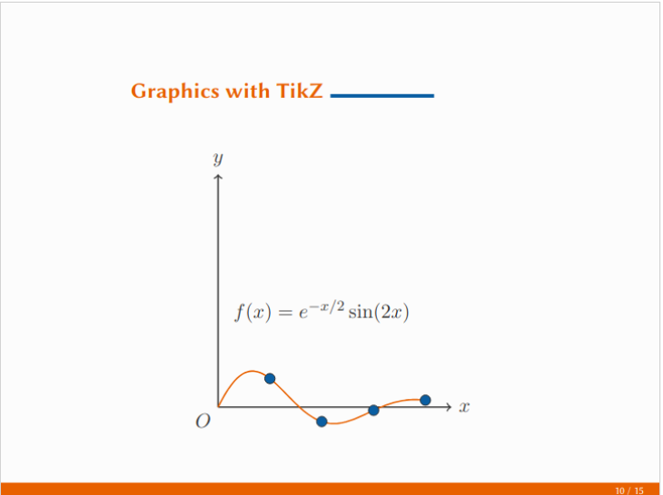
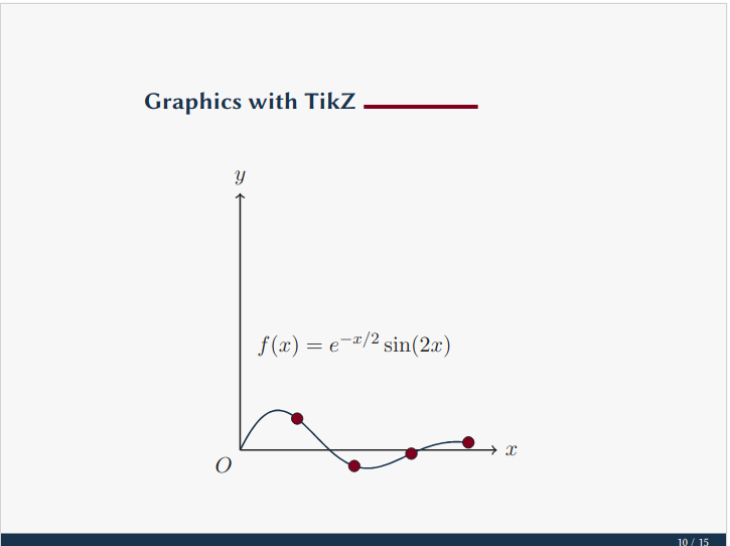
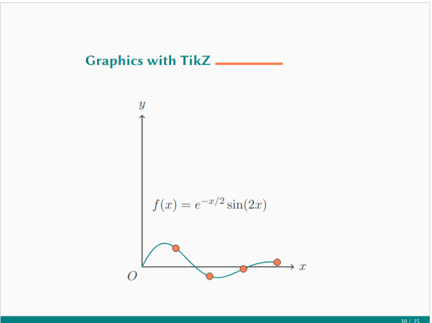
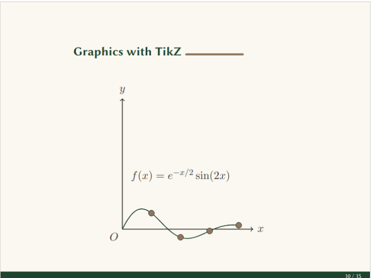

# Custom Beamer Theme

A professional, modern, and customizable theme for LaTeX Beamer presentations with multiple color palette options.

<div style="display: flex; flex-wrap: wrap; gap: 10px; justify-content: center;">
  <div style="flex: 1; min-width: 100px; max-width: 300px;">
    
  </div>
  <div style="flex: 1; min-width: 100px; max-width: 300px;">
    
  </div>
  <div style="flex: 1; min-width: 100px; max-width: 300px;">
    
  </div>
  <div style="flex: 1; min-width: 100px; max-width: 300px;">
    
  </div>
</div>

## Overview

This Beamer theme provides:

- Clean, professional design
- Modular structure following Beamer conventions
- 15 different color palettes for different presentation contexts
- Enhanced typography
- Custom blocks, title page, and frame layouts
- Support for code listings, math equations, and tables
- Proper frame title formatting with accent line

### Example

- `presentation.tex` - Example presentation demonstrating features

## Usage

### Basic Usage

```latex
\documentclass{beamer}
\usetheme{custom}

\title{My Presentation}
\author{Your Name}
\institute{Your Institution}
\date{\today}

\begin{document}

\begin{frame}[plain]
  \titlepage
\end{frame}

\begin{frame}
  \frametitle{Sample Frame}
  Content goes here
\end{frame}

\end{document}
```

### Selecting Color Palettes

Choose from five color palettes by adding one of these commands after `\usetheme{custom}`:

```latex
....
%%%%%%%%%%%%%%%%%%%%%%%%%%%%%%%%%%%%%%%%%%%
% Start Custom Theme Configuration
% > Uncomment the desired theme below
%%%%%%%%%%%%%%%%%%%%%%%%%%%%%%%%%%%%%%%%%%%
% \usecolortheme{custom-academic-blue}
% \usecolortheme{custom-academic-forest}
% \usecolortheme{custom-academic-uni}
% \usecolortheme{custom-alt}
% \usecolortheme{custom-corp-black}
% \usecolortheme{custom-corp-brand}
% \usecolortheme{custom-corporate}
% \usecolortheme{custom-creative-orange}
% \usecolortheme{custom-creative-purple}
% \usecolortheme{custom-creative-teal}
% \usecolortheme{custom-minimal}
% \usecolortheme{custom-modern}
% \usecolortheme{custom-pro-burgundy}
% \usecolortheme{custom-pro-green}
% \usecolortheme{custom-pro-navy}

%%%%%%%%%%%%%%%%%%%%%%%%%%%%%%%%%
% End Custom Theme Configuration
%%%%%%%%%%%%%%%%%%%%%%%%%%%%%%%%%
....
```

### Code Listings

For code with syntax highlighting, use the listings package (already configured in the theme):

```latex
\begin{frame}[fragile]
  \frametitle{Code Example}
  \begin{lstlisting}[language=Python]
def hello_world():
    print("Hello, world!")
  \end{lstlisting}
\end{frame}
```

### Using Blocks

```latex
\begin{frame}
  \frametitle{Block Examples}
  
  \begin{block}{Standard Block}
    Content for a standard block.
  \end{block}
  
  \begin{alertblock}{Alert Block}
    Important information goes here!
  \end{alertblock}
  
  \begin{exampleblock}{Example Block}
    An example to illustrate a concept.
  \end{exampleblock}
\end{frame}
```

### Columns

```latex
\begin{frame}
  \frametitle{Two Columns}
  
  \begin{columns}
    \begin{column}{0.48\textwidth}
      Left column content
    \end{column}
    \begin{column}{0.48\textwidth}
      Right column content
    \end{column}
  \end{columns}
\end{frame}
```

## Customization

### Modifying Colors

Edit the color theme files to change colors:

```latex
% In beamercolorthemecustom.sty or any other color theme file
\definecolor{primarycolor}{RGB}{41, 128, 185} % Change RGB values
\definecolor{secondarycolor}{RGB}{46, 204, 113} % Change RGB values
\definecolor{accentcolor}{RGB}{155, 89, 182} % Change RGB values
```

### Typography

To change fonts, modify `beamerfontthemecustom.sty`:

```latex
% Change the base font package
\RequirePackage{lmodern} % Instead of libertine

% Adjust specific element fonts
\setbeamerfont{title}{size=\LARGE, series=\bfseries}
```

### Layout Adjustments

Frame title appearance can be adjusted in `beamerouterthemecustom.sty`:

```latex
% Modify the frametitle template
\defbeamertemplate*{frametitle}{custom}{
  % Make your changes here
}
```

## Color Palette References

### Default

- Primary (Blue): RGB(41, 128, 185)  
- Secondary (Green): RGB(46, 204, 113)
- Accent (Purple): RGB(155, 89, 182)

### Earth Tones

- Primary (Dark Teal): RGB(0, 77, 64)
- Secondary (Terracotta): RGB(214, 90, 49)
- Accent (Amber): RGB(251, 176, 59)

### Modern

- Primary (Indigo): RGB(75, 0, 130)
- Secondary (Mint): RGB(0, 179, 152)
- Accent (Hot Pink): RGB(255, 105, 180)

### Corporate

- Primary (Navy Blue): RGB(25, 51, 77)
- Secondary (Burgundy): RGB(128, 0, 32)
- Accent (Taupe/Gold): RGB(199, 177, 152)

### Minimal

- Primary (Dark Gray): RGB(55, 55, 55)
- Secondary (Coral Red): RGB(231, 76, 60)
- Background (White): RGB(255, 255, 255)

## Troubleshooting

### Verbatim and Code Environment Issues

Always use the `[fragile]` option for frames containing verbatim text or code:

```latex
\begin{frame}[fragile]
  % Code or verbatim content here
\end{frame}
```

### Template Definition Errors

If you get "Command already defined" errors, check for duplicate definitions in custom theme files. Use non-starred versions of `\defbeamertemplate` and set templates explicitly:

```latex
% Instead of \defbeamertemplate*{element}{theme}{...}
\defbeamertemplate{element}{theme}{...}
\setbeamertemplate{element}[theme]
```

### Missing Template Errors

Ensure all theme files are in the correct location and that you're using `\usetheme{custom}` in your document.

## License

These theme files are provided under the [MIT License](LICENSE). You're free to use, modify, and distribute them for personal and commercial use.
